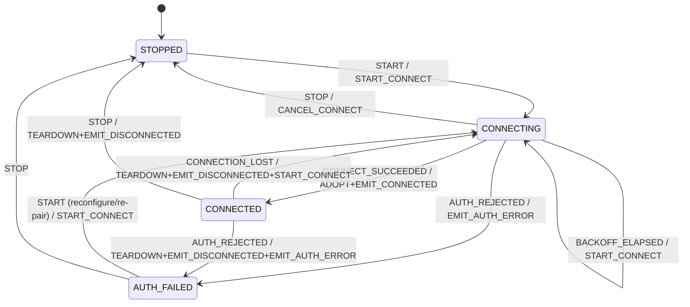

# 001 — Connection lifecycle state machine

|                         |                                                                                                                                                                |
|-------------------------|----------------------------------------------------------------------------------------------------------------------------------------------------------------|
| **Status**              | Approved (2026-07-16) — Phases 1–3 implemented; Phase 4 pending                                                                                                 |
| **Author**              | Claude (Opus 4.8), commissioned by Markus Zehnder                                                                                                              |
| **Date**                | 2026-07-16                                                                                                                                                     |
| **Reviewed**            | 2026-07-16 — verified against sources (`main` @ `4f838f1`); gaps corrected in place (poll-worker call sites, supervisor termination, conf-cache semantics, adoption bootstrap, `wait_for_state` contract, INV-6/AC-6 wording) |
| **Target version**      | 0.24.0 (current `driver.json`: 0.23.0)                                                                                                                         |
| **Affected components** | `intg-appletv/connection_machine.py` (new, pure core), `intg-appletv/tv.py` (async shell), `intg-appletv/media_player.py` (command guard), `intg-appletv/driver.py` (event wiring / UX), `tests/`, `.github/workflows/` (CI) |
| **Source**              | `REVIEW-Claude-20260715.md` § A ("Connection lifecycle — the core refactor")                                                                                   |

---

## Summary

Replace the *implicit* connection state machine in `AppleTv` — currently spread
across ~10 methods and 6 mutable fields, driven from 5 unsynchronized event
sources with no lock and no single owner — with a **sans-I/O state machine**: a
pure, synchronous `ConnectionMachine` that maps `(state, event) → (new state,
ordered actions)` with **no `await`, no asyncio, no pyatv**, wrapped by a thin
async shell in `AppleTv` that performs the I/O the machine asks for and feeds
results back as events.

The shell serializes every trigger through a single `asyncio.Queue` consumed by
one supervisor coroutine. Because the machine is pure and the queue has exactly
one consumer, there are **no locks** and the historical reconnection races become
structurally impossible.

The sans-I/O split is the point: the entire decision logic — every transition,
every backoff, the exactly-once connect/disconnect edge semantics, the terminal
auth state — lives in a module that imports neither `asyncio` nor `pyatv` and is
tested by plain synchronous function calls with **zero mocks**. This is what makes
the state machine *fully* unit-testable, as required by the project owner.

### Why sans-I/O

> "Bring your own I/O." The protocol/state logic is written as a pure function of
> its inputs; all network and timing effects are pushed to the edges. (See Brett
> Cannon, *"Network protocols, sans I/O"*; the pattern underlies `h11`, `h2`,
> `sans-io` HTTP/WebSocket libraries.)

For this driver it means: the flaky, timing-dependent part (pyatv scan/connect,
push callbacks, backoff sleeps) is a thin adapter, and the part that has
historically shipped bugs (the transition logic) is deterministic and exhaustively
testable without a network, an event loop, or a mocked Apple TV.

### Normative invariants

Safety-relevant; MUST hold after every phase. Tests assert them.

* **INV-1 (pure core).** `connection_machine.py` imports neither `asyncio` nor
  `pyatv` nor any I/O object. `ConnectionMachine.handle(event) -> list[Action]` is
  a pure, synchronous function of the current state plus the event. It performs no
  I/O, starts no tasks, and never blocks.
* **INV-2 (state lives only in the machine).** `ConnectionState` is owned by the
  machine. The shell never branches lifecycle logic on ad-hoc booleans; it reads
  `machine.state` only to decide handle adoption/disposal.
* **INV-3 (single `_atv` writer).** `self._atv` is assigned **only** by the
  supervisor loop while executing an `ADOPT_CONNECTION` or `TEARDOWN` action. The
  connect task never assigns `self._atv`; it hands its handle to the loop via the
  event payload.
* **INV-4 (all events serialized).** Every input — external triggers, I/O
  completions, and pyatv callbacks — enters through `_post(...)` onto the single
  queue, and the single supervisor consumer applies them one at a time.
* **INV-5 (exactly-once edge events).** `EMIT_CONNECTED` is produced by the machine
  only on `CONNECTING → CONNECTED`; `EMIT_DISCONNECTED` only on
  `CONNECTED → (CONNECTING | STOPPED | AUTH_FAILED)`. The shell emits exactly the
  events the machine returns — no duplicates from a single physical disconnect.
* **INV-6 (auth is terminal until re-armed).** In `AUTH_FAILED`, the machine emits
  no autonomous `START_CONNECT`/`SCHEDULE_RETRY` — it never leaves the state by
  itself (no backoff, no scheduled retry). Any external `START` re-arms exactly one
  fresh connect cycle. The machine cannot distinguish `START` origins: besides
  reconfigure / re-pair, the driver posts `START` on client connect, standby exit
  and entity subscribe (`driver.py:72/104/125`), and the command decorator posts it
  for a command while disconnected. Each such trigger yields at most one
  scan+connect+auth-error cycle — the same semantics as the merged P0 `connect()`
  clearing `_auth_failed` (`tv.py:620`).
* **INV-7 (callbacks never block).** pyatv's synchronous `connection_lost` /
  `connection_closed` callbacks only call `_post(Event.CONNECTION_LOST)`. They never
  `await`, never call `close()`, never run teardown inline.
* **INV-8 (no re-entrant close, no leaked handles).** `atv.close()` is called
  exactly once per handle: in `TEARDOWN` (after `self._atv` is detached) for an
  adopted connection, or as orphan disposal for a `CONNECT_SUCCEEDED` handle the
  machine did not adopt. Nothing calls `close()` on a handle still referenced by
  `self._atv`.
* **INV-9 (single supervisor, no leak).** At most one supervisor task exists per
  `AppleTv` instance. `disconnect()` terminates it after `STOPPED` is reached
  (draining the queue and orphan-disposing any pending `CONNECT_SUCCEEDED` handle,
  INV-8); the next `connect()` recreates it. Devices dropped via entity unsubscribe
  or `on_device_removed` (`driver.py:152-155`, `:320-337`) therefore leak neither a
  task nor the instance the task would pin.

---

## Prerequisites — satisfied

The standalone P0/P1 fixes this refactor builds on have **all merged to `main`**
(as of 2026-07-16, `main` @ `4f838f1`). Recorded here for provenance:

| Branch                                   | Issues | Relationship to this spec |
|------------------------------------------|--------|----------------------------|
| `fix/connect-idempotent-auth`            | 2, 3   | **Superseded in mechanism.** `AUTH_FAILED` state replaces the `_auth_failed` flag; idempotent `START` replaces idempotent `connect()`; the `CONNECT_WAIT_FOR_COMMAND` bounded wait is preserved via `wait_for_state()`. |
| `fix/find-atv-match-and-connect-timeout` | 7, 8   | **Preserved.** `_find_atv` (identifier-verified) and the `CONNECT_TIMEOUT`-bounded `pyatv.connect()` are called unchanged by the shell's connect cycle. |
| `fix/poll-scan-backoff`                  | 6      | **Preserved.** `_poll_worker` is started/stopped by the shell. Its two `_handle_disconnect()` call sites (`tv.py:1026`, `:1031`) become `_post(Event.CONNECTION_LOST)`; the scan-backoff logic itself is untouched. |
| `fix/reconfigure-persist-and-notify`     | 4      | **Adapted.** `update_config()` + the driver's disconnect→update→reconnect sequence is re-expressed as `STOP`/`START` events (see [Design § Reconfigure](#reconfigure)). |
| `fix/debounce-per-instance`              | 5      | Independent; no interaction. |

---

## Current state analysis

Line numbers are against `main` @ `4f838f1` (post-fix); the implementing agent
re-reads before editing. The P0 fixes already resolved the **auth self-cancel**
and **non-idempotent connect** at the point-fix level (`_auth_failed` flag at
`tv.py:252`; idempotent `connect()` at `:617`). What remains — and what this spec
targets — is the **structural** problem those point-fixes did not address.

### The implicit state machine (still present)

Connection state is encoded in **6 fields** (`tv.py:250-262` area): `_is_enabled`
(250), `_auth_failed` (252), `_atv` (~264), `_connect_task`, `_connection_attempts`,
`_polling`. It is manipulated by:

| Method | Approx. line | Role |
|---|---|---|
| `connect` | 617 | sets `_is_enabled`/clears `_auth_failed`; starts loop |
| `_start_connect_loop` | 623 | guard `not _connect_task and _atv is None and _is_enabled` |
| `_connect_loop` | 635 | backoff loop; while-guard now `... and not _auth_failed` |
| `_connect_once` | 705 | scan+connect; sets `_auth_failed` on `AuthenticationError` (715) |
| `_connect` | 741 | applies credentials; `CONNECT_TIMEOUT`-bounded `pyatv.connect()` (775) |
| `disconnect` | 778 | `_is_enabled=False`; `atv.close()`; cancels `_connect_task` |
| `_handle_disconnect` | 470 | `force` bypasses idempotency guard; detaches `_atv`; `close()`; emits `DISCONNECTED`; restarts loop |
| `connection_lost` | 452 | pyatv callback → `_handle_disconnect(force=True)` |
| `connection_closed` | 462 | pyatv callback → `_handle_disconnect(force=True)` |
| `async_handle_atvlib_errors` | ~156 | command decorator; network error → `_handle_disconnect()` |

### Remaining structural defects (unresolved by the P0 fixes)

* **(b) No single owner / no lock.** No `asyncio.Lock` in `tv.py`.
  `_handle_disconnect`, `disconnect`, `connect` and the decorator all mutate
  `_atv`/`_connect_task` across `await` points from different sources.
* **(c) `force=True` double-teardown.** `connection_lost` **and**
  `connection_closed` frequently both fire for one drop (452/462); `force` skips the
  idempotency guard → teardown + `DISCONNECTED` can run twice.
* **(d) Re-entrant `close()`.** `disconnect` calls `self._atv.close()` directly,
  synchronously invoking `connection_closed` → `_handle_disconnect(force=True)` →
  `close()` again; the code documents the workaround ("detach atv to prevent
  recursion", ~479).
* **(e) State reconstructed from booleans.** `_start_connect_loop` reasons about
  `not _connect_task and _atv is None and _is_enabled` — that triad *is* the missing
  `state == CONNECTING` check.

The P0 `_auth_failed` flag is itself evidence of (e): it is a fourth boolean bolted
on to approximate a state the machine will make explicit.

---

## Design

### Overview

```
   external triggers (driver)        pyatv callbacks         I/O completions
   START / STOP                      CONNECTION_LOST          CONNECT_SUCCEEDED
        │                                  │                  CONNECT_FAILED
        ▼                                  ▼                  AUTH_REJECTED
   ┌──────────────────────────────────────────────────┐     BACKOFF_ELAPSED
   │  AppleTv shell: _post(event) → asyncio.Queue      │◄──────────┘
   │  one supervisor coroutine drains the queue        │
   │     event ─► machine.handle(event) ─► [Action…]   │
   │     for action in actions: self._execute(action)  │
   └──────────────────────────────────────────────────┘
        │ actions (I/O effects)                 ▲ events (results)
        ▼                                       │
   START_CONNECT / SCHEDULE_RETRY / CANCEL_CONNECT / TEARDOWN /
   ADOPT_CONNECTION / EMIT_CONNECTED / EMIT_DISCONNECTED / EMIT_AUTH_ERROR
        │
        ▼
   pyatv scan/connect, push+poll, close   (the only place I/O happens)

   ┌───────────────────────────────────────────────┐
   │  connection_machine.py  —  PURE, no asyncio,   │
   │  no pyatv. handle(event) -> list[Action].      │
   └───────────────────────────────────────────────┘
```

### Pure core — `connection_machine.py`

```python
class ConnectionState(StrEnum):
    STOPPED = "STOPPED"          # not supervised (initial, after STOP / standby)
    CONNECTING = "CONNECTING"    # a connect cycle and/or backoff is in progress
    CONNECTED = "CONNECTED"      # live connection; push + poll running
    AUTH_FAILED = "AUTH_FAILED"  # credentials rejected; terminal until re-armed (INV-6)


class Event(StrEnum):
    START = "START"                       # connect requested
    STOP = "STOP"                         # disconnect requested
    CONNECT_SUCCEEDED = "CONNECT_SUCCEEDED"   # shell established a live handle
    CONNECT_FAILED = "CONNECT_FAILED"     # scan/connect/setup failed (retriable)
    AUTH_REJECTED = "AUTH_REJECTED"       # credentials rejected
    CONNECTION_LOST = "CONNECTION_LOST"   # pyatv lost/closed, blocked facade, poll/command drop
    BACKOFF_ELAPSED = "BACKOFF_ELAPSED"   # the scheduled retry timer fired


class Action(StrEnum):
    START_CONNECT = "START_CONNECT"       # spawn a connect cycle
    SCHEDULE_RETRY = "SCHEDULE_RETRY"     # arm a backoff timer (delay = machine.backoff_delay())
    CANCEL_CONNECT = "CANCEL_CONNECT"     # cancel in-flight connect cycle + retry timer
    ADOPT_CONNECTION = "ADOPT_CONNECTION" # promote the pending handle to the live connection
    TEARDOWN = "TEARDOWN"                 # stop polling + close the live connection
    EMIT_CONNECTED = "EMIT_CONNECTED"
    EMIT_DISCONNECTED = "EMIT_DISCONNECTED"
    EMIT_AUTH_ERROR = "EMIT_AUTH_ERROR"


class ConnectionMachine:
    def __init__(self, *, base_backoff: float = ..., max_backoff: float = ...) -> None:
        self._state = ConnectionState.STOPPED
        self._attempts = 0

    @property
    def state(self) -> ConnectionState: ...

    def backoff_delay(self) -> float:
        """Pure: current retry delay from self._attempts (replaces AppleTv._backoff)."""

    def handle(self, event: Event) -> list[Action]:
        """Pure transition function. Returns ordered actions for the shell to run."""
```

`_attempts` is pure bookkeeping owned by the machine (incremented on
`CONNECT_FAILED`, reset to 0 on `CONNECT_SUCCEEDED` and on entering `CONNECTING`
fresh). `backoff_delay()` is a pure function of `_attempts` and folds in the old
`AppleTv._backoff()` logic and constants.

### Transition table (authoritative)

Actions are returned as an **ordered** list and executed in order.

| State | Event | → State | Actions |
|---|---|---|---|
| STOPPED | START | CONNECTING | `[START_CONNECT]` (reset attempts) |
| STOPPED | STOP / others | STOPPED | `[]` |
| CONNECTING | CONNECT_SUCCEEDED | CONNECTED | `[ADOPT_CONNECTION, EMIT_CONNECTED]` (reset attempts) |
| CONNECTING | CONNECT_FAILED | CONNECTING | `[SCHEDULE_RETRY]` (attempts += 1) |
| CONNECTING | BACKOFF_ELAPSED | CONNECTING | `[START_CONNECT]` |
| CONNECTING | AUTH_REJECTED | AUTH_FAILED | `[CANCEL_CONNECT, EMIT_AUTH_ERROR]` |
| CONNECTING | STOP | STOPPED | `[CANCEL_CONNECT]` |
| CONNECTING | CONNECTION_LOST / START | CONNECTING | `[]` (no live conn yet / already connecting) |
| CONNECTED | CONNECTION_LOST | CONNECTING | `[TEARDOWN, EMIT_DISCONNECTED, START_CONNECT]` (reset attempts) |
| CONNECTED | STOP | STOPPED | `[TEARDOWN, EMIT_DISCONNECTED]` |
| CONNECTED | AUTH_REJECTED | AUTH_FAILED | `[TEARDOWN, EMIT_DISCONNECTED, EMIT_AUTH_ERROR]` |
| CONNECTED | START / stale I/O events | CONNECTED | `[]` |
| AUTH_FAILED | START | CONNECTING | `[START_CONNECT]` (reset attempts) |
| AUTH_FAILED | STOP / others | (STOPPED / AUTH_FAILED) | `[]` (STOP → STOPPED) |



### Async shell — `AppleTv` (`tv.py`)

The shell owns all I/O objects (`_atv`, connect task, retry timer, poll task) and
the machine instance. Skeleton:

```python
self._machine = ConnectionMachine()
self._events: asyncio.Queue[tuple[Event, Any]] = asyncio.Queue()  # payload only for CONNECT_SUCCEEDED
self._supervisor: asyncio.Task[None] | None = None
self._connect_task: asyncio.Task[None] | None = None
self._retry_task: asyncio.Task[None] | None = None
self._atv: pyatv.interface.AppleTV | None = None

def _post(self, event: Event, payload: Any = None) -> None:
    self._events.put_nowait((event, payload))            # INV-4, INV-7 safe from sync callbacks

async def _run_supervisor(self) -> None:                 # INV-9 (one instance)
    while True:
        event, payload = await self._events.get()
        actions = self._machine.handle(event)            # pure (INV-1)
        # orphan disposal: a success the machine did not adopt must be closed (INV-8)
        if event is Event.CONNECT_SUCCEEDED and Action.ADOPT_CONNECTION not in actions and payload is not None:
            payload.close()
        try:
            for action in actions:
                await self._execute(action, payload)
        except _AdoptFailed:
            self._post(Event.CONNECTION_LOST)            # post-setup blocked → reconnect (F4)
```

`_execute` maps each `Action` to I/O:

* `START_CONNECT` → spawn `self._connect_task = create_task(self._connect_cycle())` (**spawned task, per resolved Q2** — keeps the supervisor free to process `STOP` while a connect attempt is physically in flight).
* `SCHEDULE_RETRY` → spawn `self._retry_task` that sleeps `self._machine.backoff_delay()` then `_post(Event.BACKOFF_ELAPSED)`.
* `CANCEL_CONNECT` → cancel `_connect_task` and `_retry_task`.
* `ADOPT_CONNECTION` → `self._atv = payload` (**only place the shell sets a live `_atv`**, INV-3); wire `self._atv.listener = self`, `push_updater.listener = self`, `push_updater.start()`, `audio.listener = self`; `await self._start_polling()`; then the **fresh-connection refresh bootstrap** currently in `_connect_loop` (`tv.py:674-685`): re-arm `_app_list_supported = True`, zero both refresh timers, eagerly spawn `_update_app_list` (if the feature is available) and `_update_output_devices`, and push both timers one full interval into the future. Dropping the bootstrap would latch `_app_list_supported = False` across reconnects and regress the issue-6 scan backoff. On any failure raise `_AdoptFailed` (handled above).
* `TEARDOWN` → `await self._stop_polling()`; `atv, self._atv = self._atv, None`; `if atv: atv.close()` (INV-8).
* `EMIT_CONNECTED` / `EMIT_DISCONNECTED` / `EMIT_AUTH_ERROR` → emit `EVENTS.CONNECTED` / `EVENTS.DISCONNECTED` / `EVENTS.ERROR(identifier, "authentication_failed")`.

`_connect_cycle` (spawned): `atv = await <scan via _find_atv> + <_connect, CONNECT_TIMEOUT-bounded>`; on success `_post(Event.CONNECT_SUCCEEDED, atv)`; on `AuthenticationError` `_post(Event.AUTH_REJECTED)`; on any other exception `_post(Event.CONNECT_FAILED)`; on `asyncio.CancelledError` it posts nothing and re-raises. **It never assigns `self._atv`** (INV-3) — accordingly `_connect` (`tv.py:741`, otherwise preserved) changes to **return** the connected handle instead of assigning `self._atv` at `:776`. The cycle preserves `_connect_once`'s config-cache semantics (`tv.py:705-739`): reuse `self._apple_tv_conf` when set to skip the scan, and clear it to `None` on a generic connect failure so the next attempt re-resolves via `_find_atv()` — required for a changed IP/MAC to recover. The in-cycle network-unreachable quick retry (`OSError` errno 101/10065, `ERROR_OS_WAIT`) stays inside the cycle; it is invisible to the machine.

pyatv callbacks collapse to one line each (INV-7):

```python
@override
def connection_lost(self, exception: Exception | None) -> None:
    _LOG.warning("[%s] Lost connection: %s", self.log_id, exception)
    self._post(Event.CONNECTION_LOST)

@override
def connection_closed(self) -> None:
    self._post(Event.CONNECTION_LOST)
```

**Deleted:** `_handle_disconnect` (and its `force` parameter), `_start_connect_loop`,
`_connect_loop`, `_connect_once`, `_backoff`, and the fields `_is_enabled`,
`_auth_failed`, `_connection_attempts`. **All** remaining `_handle_disconnect()`
callers change to `self._post(Event.CONNECTION_LOST)`: the decorator's
network-error/blocked branches (`tv.py:203`, `:225`) **and** the two `_poll_worker`
call sites (`tv.py:1026`, `:1031`). The unused `EVENTS.CONNECTING` emission
(`tv.py:625`; no driver handler exists) is dropped with `_start_connect_loop`.

### Public API and awaited transitions

Public method names `connect()` / `disconnect()` are **kept** (driver call sites
unchanged), redefined as thin, idempotent wrappers, plus a `wait_for_state` helper
so await-based callers keep working:

```python
async def connect(self) -> None:                # idempotent "ensure supervised + connecting"
    if self._supervisor is None or self._supervisor.done():
        self._supervisor = self._loop.create_task(self._run_supervisor())
    self._post(Event.START)

async def disconnect(self) -> None:             # await STOPPED so reconfigure/unsubscribe stay correct
    self._post(Event.STOP)
    await self.wait_for_state({ConnectionState.STOPPED}, timeout=STOP_TIMEOUT)
    await self._stop_supervisor()               # cancel + drain queue, orphan-dispose (INV-8, INV-9)

@property
def state(self) -> ConnectionState:
    return self._machine.state
```

`wait_for_state(targets, timeout)` awaits an `asyncio.Event` that the shell pulses
on every applied transition (a small broadcast helper; the machine stays pure).
**Contract:** it returns **immediately** when the machine is already in a target
state, and on timeout it returns `False` instead of raising — so neither
`disconnect()` nor the command decorator leaks a `TimeoutError`. The immediate
return is what makes `disconnect()` safe on a never-started instance:
`setup_flow.py` calls it on pairing-only `AppleTv` objects (`:136`, `:362`, `:558`)
that never had a supervisor; those must not block for `STOP_TIMEOUT`.

`_stop_supervisor()` cancels the supervisor task, then drains the queue and closes
any `CONNECT_SUCCEEDED` payload via orphan disposal (INV-8) so no handle leaks; the
next `connect()` recreates the supervisor (INV-9). Without this, every device
dropped by entity unsubscribe or `on_device_removed` would leak a forever-running
supervisor task pinning the `AppleTv` instance.

**Retire `_is_enabled` (resolved Q3).** The boolean field is removed entirely. The
`is_enabled` property becomes `self.state is not ConnectionState.STOPPED`, and the
`media_player.py` command guard (`~208`) reads it unchanged. Goal: one source of
truth (the machine), no shadow booleans.

### Command decorator (issue 3 behaviour, preserved)

```python
if self._atv is None:
    await self.connect()
    await self.wait_for_state({ConnectionState.CONNECTED}, timeout=CONNECT_WAIT_FOR_COMMAND)
    if self._atv is None:
        return StatusCodes.SERVICE_UNAVAILABLE
```

### Reconfigure

`update_config()` (from the merged fix) is retained (swaps `_device`, clears
`_apple_tv_conf`). The driver sequence is re-expressed with the awaited wrappers:

```python
await atv.disconnect()          # posts STOP, awaits STOPPED
atv.update_config(new_device)   # supervisor idle, _atv is None, machine STOPPED
await atv.connect()             # posts START → fresh scan with the new address/mac
```

### Entity & device state mapping

Cross-checked against the UC integration AsyncAPI (`UCR-integration-asyncapi.yaml`)
and `ucapi` 0.7.0, **corrected per project-owner guidance**.

**`device_state` is an integration-level state, not a physical-device state.**
`ucapi.DeviceStates` (`CONNECTING / CONNECTED / DISCONNECTED / ERROR`, via
`api.set_device_state`) reports whether *the integration driver itself* is
available/running — **not** the connection to an individual Apple TV. It must **not**
be driven by a device's connect/disconnect/auth, otherwise one unavailable Apple TV
would flip the whole integration — including any healthy devices — to unavailable.
The existing integration-level calls (`set_device_state(CONNECTED)`, driver.py:69,
161) stay as-is; this spec does not couple `device_state` to the per-device machine.

> The integration's multi-device capability was designed but **never implemented and
> is being removed**; the driver effectively manages a single Apple TV. The
> per-instance state machine is correct either way — this note only records why no
> cross-device `device_state` aggregation is specified.

**Physical Apple TV status is conveyed only through entity states.**
`ucapi.media_player.States` = `UNAVAILABLE, UNKNOWN, ON, OFF, PLAYING, PAUSED,
STANDBY, BUFFERING` — there is **no `CONNECTING` and no `ERROR`** state. A connected
device drives the live states; every non-connected condition renders the entities
`UNAVAILABLE` (which shows them **disabled** in the Remote UI):

| Machine event → shell `EVENTS` | media_player / remote entity |
|---|---|
| (entering `CONNECTING`) | `UNAVAILABLE` (already unavailable — no change) |
| `EMIT_CONNECTED` → `EVENTS.CONNECTED` | live (`ON` / `OFF` / `PLAYING` / …) |
| `EMIT_DISCONNECTED` → `EVENTS.DISCONNECTED` | `UNAVAILABLE` |
| `EMIT_AUTH_ERROR` → `EVENTS.ERROR("authentication_failed")` | `UNAVAILABLE` |

So **Q1 (connecting cue):** entities stay `UNAVAILABLE` during connect/reconnect (as
accepted). **Q2 (auth failure):** since there is no entity `ERROR` state, an
auth-failed device renders `UNAVAILABLE` (disabled). `EVENTS.ERROR` still carries the
`"authentication_failed"` token for logging and for a future UI. The machine does not
emit a distinct `CONNECTING` action because it would collapse to the same
`UNAVAILABLE` — kept minimal.

> **Note — entity states should be enhanced.** The current `media_player` / `remote`
> `States` enum cannot distinguish *connecting*, *disconnected*, and
> *authentication-failed / needs re-pairing* — all collapse to `UNAVAILABLE`. A
> reconnecting device, a dropped device, and a bad-credentials device therefore look
> identical in the UI, and an auth failure is not actionable by the user. This is an
> **integration-API / `ucapi` limitation worth raising upstream**: add a
> `CONNECTING` state and an error / `auth_error` state (or a diagnostic attribute) to
> the entity `States`. When available, the machine's existing
> `CONNECTED` / `DISCONNECTED` / `AUTH_FAILED` transitions map to them directly — only
> the driver's entity-state mapping updates, no core change.

### Constants

Add `STOP_TIMEOUT = 5.0` (shell). Reuse `CONNECT_WAIT_FOR_COMMAND`, `CONNECT_TIMEOUT`.
The backoff constants move into `connection_machine.py` alongside `backoff_delay()`.

---

## Failure mode analysis

| # | Historical failure | Root cause | Eliminated by |
|---|---|---|---|
| F1 | Auth error cancels the connect task mid-run; device silently dead | `disconnect()` from within `_connect_task`; no user event | `AUTH_REJECTED → AUTH_FAILED` in the pure machine (INV-6); `EMIT_AUTH_ERROR`; no self-cancel |
| F2 | Duplicate `DISCONNECTED` / double teardown | `connection_lost`+`connection_closed` both fire; `force` skips guard | Both post `CONNECTION_LOST`; second arrives in `CONNECTING`/`STOPPED` → `[]`; `EMIT_DISCONNECTED` only on the `CONNECTED →` edge (INV-5) |
| F3 | Re-entrant `atv.close()` recursion | `close()` while `_atv` still set → callback re-enters | `TEARDOWN` detaches `_atv` before `close()` (INV-8); callbacks only `_post` (INV-7) |
| F4 | Permanent dead state after blocked facade during post-connect setup | `_connect_task` cleared before setup; dead non-None `_atv` | `ADOPT_CONNECTION` setup failure → `_AdoptFailed` → `_post(CONNECTION_LOST)` → machine reconnects |
| F5 | Hung `pyatv.connect()` wedges the loop | no timeout | `CONNECT_TIMEOUT` (merged) → `_connect_cycle` posts `CONNECT_FAILED` |
| F6 | Teardown races connect (`_atv` nulled mid-op) | multiple writers of `_atv` | Single writer = supervisor loop (INV-3); connect task never writes `_atv` |
| F7 | Standby bounce (STOP then immediate START) leaves stale task | uncoordinated `connect`/`disconnect` | Serialized queue; `STOP → CANCEL_CONNECT`, `START → START_CONNECT`, deterministic |
| F8 | Command right after standby wake → instant 503 | `connect()` didn't await a connection | `wait_for_state(CONNECTED, CONNECT_WAIT_FOR_COMMAND)` in decorator |
| F9 | Orphaned handle when `STOP` races a successful connect | success adopted with no owner | Orphan disposal closes a `CONNECT_SUCCEEDED` handle the machine did not adopt (INV-8) |

Everything in this table is now covered by a deterministic unit test (see below),
not by inspection.

---

## Test plan

The whole point of the sans-I/O split is the first bucket: it needs **no mocks,
no event loop, no network**.

Delete the dead `tests/unit/test_reconnect.py` (references non-existent
`AtvDevice(reuse_conf_timeout=...)` / `time.monotonic` gating). Add `pytest`
(+`pytest-asyncio`, used only by the shell bucket) to `test-requirements.txt` and a
`tests/conftest.py` that puts `intg-appletv/` on `sys.path`.

### Bucket A — pure `ConnectionMachine` (no mocks, no asyncio)

`tests/unit/test_connection_machine.py`. Each test constructs a `ConnectionMachine`,
optionally drives it to a state via a sequence of `handle(...)` calls, then asserts
`machine.state` and the returned `list[Action]`. Cover the **entire transition
table** — every `(state, event)` cell, including the no-op cells — plus:

| ID | Scenario | Assertion |
|---|---|---|
| A-HAPPY | `STOPPED —START→ CONNECTING —CONNECT_SUCCEEDED→` | state `CONNECTED`; actions `[ADOPT_CONNECTION, EMIT_CONNECTED]` |
| A-BACKOFF | repeated `CONNECT_FAILED` | stays `CONNECTING`; each returns `[SCHEDULE_RETRY]`; `backoff_delay()` increases then caps; resets to base after `CONNECT_SUCCEEDED` |
| A-LOST | `CONNECTED —CONNECTION_LOST→` | `CONNECTING`; `[TEARDOWN, EMIT_DISCONNECTED, START_CONNECT]` |
| A-DUP-LOST | `CONNECTED —CONNECTION_LOST→ CONNECTING —CONNECTION_LOST→` | second returns `[]`; exactly one `EMIT_DISCONNECTED` across the pair (INV-5, F2) |
| A-AUTH | `CONNECTING —AUTH_REJECTED→` | `AUTH_FAILED`; `[CANCEL_CONNECT, EMIT_AUTH_ERROR]`; subsequent `BACKOFF_ELAPSED`/`START`-less events yield no `START_CONNECT` (INV-6) |
| A-AUTH-REARM | `AUTH_FAILED —START→` | `CONNECTING`; `[START_CONNECT]` |
| A-STOP-CONNECTING | `CONNECTING —STOP→` | `STOPPED`; `[CANCEL_CONNECT]`; no `EMIT_DISCONNECTED` |
| A-BOUNCE | `CONNECTED —STOP→ STOPPED —START→` | ends `CONNECTING`; `[START_CONNECT]` (F7) |
| A-STALE | stale `CONNECT_SUCCEEDED`/`BACKOFF_ELAPSED` in `STOPPED`/`CONNECTED` | `[]`, state unchanged |
| A-PURITY | `import connection_machine; assert "asyncio" not in sys.modules-added-by-it` (or AST/import check) | module imports no `asyncio`/`pyatv` (INV-1) |

Bucket A is exhaustive and deterministic — it is the primary evidence for the
acceptance criteria.

### Bucket B — async shell (`AppleTv`) integration, with fakes

`tests/unit/test_connection_shell.py` (uses `pytest-asyncio`). A **fake pyatv**
(scan/connect return canned handles; a `FakeAtv` whose `.close()` optionally invokes
`connection_closed` synchronously) verifies the shell honours the machine's actions
and the I/O-side invariants:

| ID | Scenario | Assertion |
|---|---|---|
| B-WIRE | happy connect | `_atv` adopted once; listeners wired; poll started; one `EVENTS.CONNECTED` |
| B-SINGLE-WRITER | connect cycle completes | `_atv` was written only by the supervisor (connect task left it `None`) (INV-3) |
| B-ORPHAN | `STOP` processed, then a late `CONNECT_SUCCEEDED` arrives | payload handle `.close()`d, `_atv` stays `None` (F9, INV-8) |
| B-REENTRANT | `FakeAtv.close()` fires `connection_closed` synchronously | no recursion; single teardown (F3, INV-7) |
| B-ADOPT-FAIL | adoption setup raises `BlockedStateError` | shell posts `CONNECTION_LOST`; machine reconnects (F4) |
| B-CMD-WAIT / B-CMD-503 | decorated command while disconnected | succeeds within `CONNECT_WAIT_FOR_COMMAND`, else `SERVICE_UNAVAILABLE` without blocking past the window (F8) |
| B-DISCONNECT-AWAIT | `await disconnect()` | returns only after state reaches `STOPPED` |
| B-SHUTDOWN | `await disconnect()` on a supervised device with a late `CONNECT_SUCCEEDED` queued | supervisor task cancelled; queued handle `.close()`d; no task or handle leak (INV-9) |
| B-NO-SUPERVISOR | `await disconnect()` on a never-connected instance (setup-flow pairing object) | returns immediately; no hang, no supervisor created |
| B-REFRESH-BOOTSTRAP | reconnect after a device that latched `_app_list_supported = False` | adoption re-arms the latch and eagerly refreshes app list / output devices (issue 6 preserved) |

### CI

Add a `pytest` job to `.github/workflows/` (currently ruff+pyright only), Python
3.11, installing `test-requirements.txt` and running `pytest tests/`.

---

## Implementation plan

### Phase 1 — Pure `ConnectionMachine` + exhaustive unit tests + test infra  *(serial; blocks the rest)*

**Files:** `intg-appletv/connection_machine.py` (new), `tests/unit/test_connection_machine.py`
(new), `tests/conftest.py` (new), delete `tests/unit/test_reconnect.py`,
`test-requirements.txt`.

Self-contained and independently mergeable: the module is pure and not yet wired
into production, and it lands **with** full Bucket-A coverage. Delivers the
"fully unit-testable state machine" as a reviewable unit before any `tv.py` churn.
Does **not** touch `tv.py`.

### Phase 2 — CI `pytest` job  *(parallel with Phase 3, after Phase 1)*

**Files:** `.github/workflows/*.yml` only. File-disjoint from Phase 3.

### Phase 3 — Async shell integration in `AppleTv`  *(after Phase 1)*

**Files:** `intg-appletv/tv.py`, `intg-appletv/media_player.py` (decorator/guard),
`intg-appletv/driver.py` (reconfigure sequence via `stop`/`start`; `is_enabled`
now derived), `tests/unit/test_connection_shell.py` (new, Bucket B). Drives the
machine from the supervisor; deletes `_handle_disconnect`/`_start_connect_loop`/
`_connect_loop`/`_connect_once`/`_backoff` and the `_is_enabled`/`_auth_failed`/
`_connection_attempts` fields; converts the remaining `_handle_disconnect()` call
sites (decorator `tv.py:203/:225`, `_poll_worker` `:1026/:1031`) to
`_post(Event.CONNECTION_LOST)`; changes `_connect` to return the handle instead of
assigning `self._atv`; adds `_stop_supervisor()` (called from `disconnect()`).

### Phase 4 — Entity-state mapping & device-state scoping  *(after Phase 3)*

**Files:** `intg-appletv/driver.py`, `tests/unit/test_driver_entity_state.py` (new).
Ensure the `EVENTS.CONNECTED / DISCONNECTED / ERROR` handlers map to entity states
per [Design § Entity & device state mapping](#entity--device-state-mapping):
`CONNECTED` → live entity states; `DISCONNECTED` and `ERROR("authentication_failed")`
→ `UNAVAILABLE`. Keep `device_state` **integration-level** — do **not** drive it from
per-device connect/disconnect/auth. File the upstream request to enhance the entity
`States` enum (connecting / auth-error). Tested with a fake `ucapi.IntegrationAPI`.
Depends on Phase 3's events. (Small phase — the existing driver handlers already do
most of this; the work is verifying the auth-error path and removing any per-device
`device_state` coupling.)

**Dependency graph:** Phase 1 → { Phase 2 (∥), Phase 3 }; Phase 3 → Phase 4.
Phase 2 and Phase 3 are file-disjoint and may run as parallel git-worktree agents.

---

## Acceptance criteria

* **AC-1 — unit test suite (REQUIRED).** A unit test suite exists, is wired into
  CI, and passes. Bucket A covers **every cell** of the transition table plus the
  scenario rows, using **no mocks and no event loop**. Bucket B covers the shell
  I/O invariants with fakes. CI fails if any test fails. *This criterion is
  mandatory: the feature is not complete without it.*
* **AC-2 — sans-I/O separation.** `connection_machine.py` imports neither `asyncio`
  nor `pyatv` (asserted by test A-PURITY / an import check). `ConnectionMachine.handle`
  performs no I/O and is synchronous.
* **AC-3 — invariants.** INV-1…INV-9 hold, each asserted by at least one test.
* **AC-4 — dead code gone.** `_handle_disconnect`, `_start_connect_loop`,
  `_connect_loop`, `_connect_once`, `_backoff`, the `force` parameter, and the
  `_is_enabled` / `_auth_failed` / `_connection_attempts` fields no longer exist.
  `grep -n "asyncio.Lock" intg-appletv/tv.py` returns nothing.
* **AC-5 — exactly-once edges.** A single physical disconnect yields exactly one
  `EVENTS.DISCONNECTED` (A-DUP-LOST, F2).
* **AC-6 — auth terminal + recovery.** Bad credentials → `AUTH_FAILED`, one
  `EVENTS.ERROR`, zero **autonomous** further scan/connect (no backoff-driven
  retry). Each external `START` — reconfigure/re-pair, but also client connect,
  standby exit, entity subscribe or a command while disconnected — re-arms at most
  one fresh cycle (INV-6). A reconfigure/re-pair recovers without a driver restart
  (A-AUTH, A-AUTH-REARM).
* **AC-7 — post-standby command.** A command right after standby wake succeeds
  within `CONNECT_WAIT_FOR_COMMAND` instead of an immediate 503 (B-CMD-WAIT).
* **AC-8 — toolchain green.** `./lint.sh` (ruff + pyright strict) green; CI
  (ruff + pyright + the new pytest job) green.
* **AC-9 — real-device smoke test.** Against a real Apple TV: connect; force a
  network drop (unplug/reboot) and confirm automatic reconnect; enter/exit standby;
  feed wrong credentials and confirm the device reports an auth error rather than
  silently dying. (Correctness is proven by Bucket A; this confirms integration with
  real pyatv timing.)
* **AC-10 — entity-state mapping & device-state scoping (Phase 4).** A connected
  device drives live entity states; connecting / disconnected / authentication-failed
  all render the entities `UNAVAILABLE`. The integration `device_state` is **not**
  coupled to per-device connection (stays integration-level), so one unavailable
  Apple TV never marks the integration unavailable. Verified by a driver-level test
  with a fake `IntegrationAPI`.

---

## Resolved decisions

* **Q1 — model `STOPPING`? → Omit.** Teardown is a single synchronous action batch;
  no observable intermediate. Revisit only if teardown ever needs a long, externally
  visible await.
* **Q2 — connecting step: async task vs. synchronous loop? → Spawned task.** The
  connect cycle runs as `self._connect_task` so `STOP` stays responsive while a
  connect attempt is physically in flight (scenario B/T-STOP-WHILE-CONNECTING, F7).
* **Q3 — retire `_is_enabled`? → Retire.** Removed entirely; `is_enabled` derives
  from `state`. Single source of truth, per the clean-design goal.
* **Q5 — land the P0 fix first? → Merged.** All prerequisites are on `main`; Phase 3
  supersedes the `_auth_failed` mechanism.
* **Q4 — how to surface `CONNECTING` / `AUTH_FAILED`? → Entity `UNAVAILABLE`.**
  `device_state` is an *integration-level* state (is the driver itself up), **not**
  the physical Apple TV connection, so it must not be driven by per-device events.
  Physical status is conveyed via entity states; since `media_player` has no
  `CONNECTING` / `ERROR` state, connecting / disconnected / auth-failed all render
  `UNAVAILABLE` (disabled in the UI). Entity states should be enhanced upstream to
  distinguish these — see [Design § Entity & device state mapping](#entity--device-state-mapping).

---

## Open questions

* **None blocking.** One tracked follow-up (not a blocker for any phase): raise an
  upstream `ucapi` / integration-API request to enhance the entity `States` enum with
  *connecting* and *auth-error* states, so those conditions are distinguishable from a
  plain `UNAVAILABLE` (see [Design § Entity & device state mapping](#entity--device-state-mapping)).
  The integration's unused multi-device capability is being removed separately; the
  per-instance state machine is unaffected.
